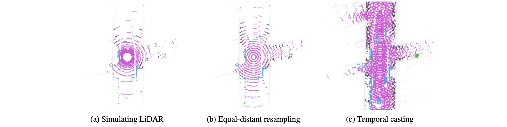

# SparseOcc

This is the official PyTorch implementation for our paper:

> [**SparseOcc: Fully Sparse 3D Occupancy Prediction**](https://arxiv.org/abs/2312.17118)<br>
> :school: Presented by Nanjing University and Shanghai AI Lab<br>
> :email: Primary contact: Haisong Liu (afterthat97@gmail.com)<br>
> :trophy: [CVPR 2024 Autonomous Driving Challenge - Occupancy and Flow](https://opendrivelab.com/challenge2024/#occupancy_and_flow)

## Highlights

**New model**:1st_place_medal:: SparseOcc initially reconstructs a sparse 3D representation from visual inputs and subsequently predicts semantic/instance occupancy from the 3D sparse representation by sparse queries.


**New evaluation metric**:chart_with_upwards_trend:: We design a thoughtful ray-based evaluation metric, namely RayIoU, to solve the inconsistency penalty along depths raised in traditional voxel-level mIoU criteria.



## News

* 2024-04-11: The panoptic version of SparseOcc ([configs/r50_nuimg_704x256_8f_pano.py](configs/r50_nuimg_704x256_8f_pano.py)) is released.
* 2024-04-09: An updated arXiv version [https://arxiv.org/abs/2312.17118v3](https://arxiv.org/abs/2312.17118v3) has been released.
* 2024-03-31: We release the code and pretrained weights.
* 2023-12-30: We release the paper.

## Model Zoo

| Setting  | Pretrain | Training Cost | RayIoU | RayPQ | FPS | Weights |
|----------|:--------:|:-------------:|:------:|:-----:|:---:|:-------:|
| [r50_nuimg_704x256_8f](configs/r50_nuimg_704x256_8f.py) | [nuImg](https://download.openmmlab.com/mmdetection3d/v0.1.0_models/nuimages_semseg/cascade_mask_rcnn_r50_fpn_coco-20e_20e_nuim/cascade_mask_rcnn_r50_fpn_coco-20e_20e_nuim_20201009_124951-40963960.pth) | 1d4h, ~12GB Memory | 35.0 | - | 17.3 | [gdrive](https://drive.google.com/file/d/18qZMIJMxU-3UZi7nU1_Q-hvvrtjlIN_p/view?usp=sharing) |
| [r50_nuimg_704x256_8f_pano](configs/r50_nuimg_704x256_8f_pano.py) | [nuImg](https://download.openmmlab.com/mmdetection3d/v0.1.0_models/nuimages_semseg/cascade_mask_rcnn_r50_fpn_coco-20e_20e_nuim/cascade_mask_rcnn_r50_fpn_coco-20e_20e_nuim_20201009_124951-40963960.pth) | 1d4h, ~12GB Memory | 34.5 | 14.0 | 17.3 | [gdrive](https://drive.google.com/file/d/1NKM52uTJT-UQLmbUfll81fd0Ay1k0zOw/view?usp=sharing) |

* FPS is measured with Intel(R) Xeon(R) Platinum 8369B CPU and NVIDIA A100-SXM4-80GB GPU (PyTorch `fp32` backend, including data loading).
* We will release more settings in the future.

## Environment

> The requirements are the same as those of [SparseBEV](https://github.com/MCG-NJU/SparseBEV).

Install PyTorch 2.0 + CUDA 11.8:

```
conda create -n sparseocc python=3.8
conda activate sparseocc
conda install pytorch==2.0.0 torchvision==0.15.0 pytorch-cuda=11.8 -c pytorch -c nvidia
```

or PyTorch 1.10.2 + CUDA 10.2 for older GPUs:

```
conda create -n sparseocc python=3.8
conda activate sparseocc
conda install pytorch==1.10.2 torchvision==0.11.3 cudatoolkit=10.2 -c pytorch
```

Install other dependencies:

```
pip install openmim
mim install mmcv-full==1.6.0
mim install mmdet==2.28.2
mim install mmsegmentation==0.30.0
mim install mmdet3d==1.0.0rc6
pip install setuptools==59.5.0
pip install numpy==1.23.5
```

Install turbojpeg and pillow-simd to speed up data loading (optional but important):

```
sudo apt-get update
sudo apt-get install -y libturbojpeg
pip install pyturbojpeg
pip uninstall pillow
pip install pillow-simd==9.0.0.post1
```

Compile CUDA extensions:

```
cd models/csrc
python setup.py build_ext --inplace
```

## Prepare Dataset

> The first two steps are the same as those of [SparseBEV](https://github.com/MCG-NJU/SparseBEV).

1. Download nuScenes from [https://www.nuscenes.org/nuscenes](https://www.nuscenes.org/nuscenes), put it to `data/nuscenes` and preprocess it with [mmdetection3d](https://github.com/open-mmlab/mmdetection3d/tree/v1.0.0rc6).

2. Download the generated info file from [gdrive](https://drive.google.com/file/d/1uyoUuSRIVScrm_CUpge6V_UzwDT61ODO/view?usp=sharing) and unzip it. These `*.pkl` files can also be generated with our script: `gen_sweep_info.py`.

3. Download Occ3D-nuScenes occupancy GT from [gdrive](https://drive.google.com/file/d/1kiXVNSEi3UrNERPMz_CfiJXKkgts_5dY/view?usp=drive_link), unzip it, and save it to `data/nuscenes/occ3d`.

4. Folder structure:

```
data/nuscenes
├── maps
├── nuscenes_infos_test_sweep.pkl
├── nuscenes_infos_train_sweep.pkl
├── nuscenes_infos_val_sweep.pkl
├── samples
├── sweeps
├── v1.0-test
└── v1.0-trainval
└── occ3d
    ├── scene-0001
    │   ├── 0037a705a2e04559b1bba6c01beca1cf
    │   │   └── labels.npz
    │   ├── 026155aa1c554e2f87914ec9ba80acae
    │   │   └── labels.npz
    ...
```

5. (Optional) Generate the panoptic occupancy ground truth with `gen_instance_info.py`. The panoptic version of Occ3D will be saved to `data/nuscenes/occ3d_panoptic`.

## Training

Train SparseOcc with 8 GPUs:

```
torchrun --nproc_per_node 8 train.py --config configs/sparseocc_r50_nuimg_704x256_8f.py
```

Train SparseOcc with 4 GPUs (i.e the last four GPUs):

```
export CUDA_VISIBLE_DEVICES=4,5,6,7
torchrun --nproc_per_node 4 train.py --config configs/sparseocc_r50_nuimg_704x256_8f.py
```

The batch size for each GPU will be scaled automatically. So there is no need to modify the `batch_size` in config files.

## Evaluation

Single-GPU evaluation:

```
export CUDA_VISIBLE_DEVICES=0
python val.py --config configs/sparseocc_r50_nuimg_704x256_8f.py --weights checkpoints/sparseocc_r50_nuimg_704x256_8f.pth
```

Multi-GPU evaluation:

```
export CUDA_VISIBLE_DEVICES=0,1,2,3,4,5,6,7
torchrun --nproc_per_node 8 val.py --config configs/sparseocc_r50_nuimg_704x256_8f.py --weights checkpoints/sparseocc_r50_nuimg_704x256_8f.pth
```

## Timing

FPS is measured with a single GPU:

```
export CUDA_VISIBLE_DEVICES=0
python timing.py --config configs/sparseocc_r50_nuimg_704x256_8f.py --weights checkpoints/sparseocc_r50_nuimg_704x256_8f.pth
```

## Acknowledgements

Many thanks to these excellent open-source projects:

* [MaskFormer](https://github.com/facebookresearch/MaskFormer)
* [NeuralRecon](https://github.com/zju3dv/NeuralRecon)
* [4D-Occ](https://github.com/tarashakhurana/4d-occ-forecasting)
* [MMDetection3D](https://github.com/open-mmlab/mmdetection3d)
