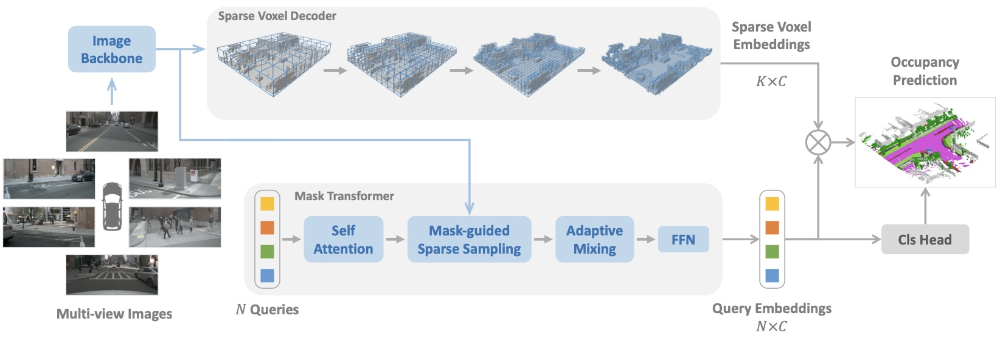

# SparseOcc

This is the official PyTorch implementation for our paper:

> [**Fully Sparse 3D Panoptic Occupancy Prediction**](https://arxiv.org/abs/2312.17118)<br>
> :school: Presented by Nanjing University and Shanghai AI Lab<br>
> :email: Primary contact: Haisong Liu (afterthat97@gmail.com)<br>
> :trophy: [CVPR 2024 Autonomous Driving Challenge - Occupancy and Flow](https://opendrivelab.com/challenge2024/#occupancy_and_flow)<br>
> :book: 中文解读（官方）：https://zhuanlan.zhihu.com/p/709576252<br>
> :book: 中文解读（第三方）: [AIming](https://zhuanlan.zhihu.com/p/691549750), [自动驾驶之心](https://zhuanlan.zhihu.com/p/675811281)

## :warning: Important Notes

There is another concurrent project titled *''SparseOcc: Rethinking sparse latent representation for vision-based semantic occupancy prediction''* by Tang et al., which shares the same name SparseOcc with ours. However, this repository is **unrelated** to the aforementioned paper.

If you cite our research, please ensure that you reference the correct version (arXiv **2312.17118**, authored by **Liu et al.**):

```
@article{liu2023fully,
  title={Fully sparse 3d panoptic occupancy prediction},
  author={Liu, Haisong and Wang, Haiguang and Chen, Yang and Yang, Zetong and Zeng, Jia and Chen, Li and Wang, Limin},
  journal={arXiv preprint arXiv:2312.17118},
  year={2023}
}
```

> In arXiv 2312.17118v3, we removed the word "panoptic" from the title. However, Google Scholar's database has not been updated and still shows the old one. Therefore, we still recommend citing the old title - "Fully sparse 3d panoptic occupancy prediction" - so that Google Scholar can index it correctly. Thank you all.

## News

* **2024-07-19**: We released an updated version of SparseOcc on [arXiv](https://arxiv.org/abs/2312.17118). All charts and colors have been carefully adjusted. Delete the old version and download the new one!
* **2024-07-01**: SparseOcc is accepted to ECCV 2024.
* **2024-06-27**: SparseOcc v1.1 is released. In this change, we introduce BEV data augmentation (BDA) and Lovasz-Softmax loss to further enhance the performance. Compared with [v1.0](https://github.com/MCG-NJU/SparseOcc/tree/v1.0) (35.0 RayIoU with 48 epochs), SparseOcc v1.1 can achieve 36.8 RayIoU with 24 epochs!
* **2024-05-29**: We add support for [OpenOcc v2](configs/r50_nuimg_704x256_8f_openocc.py) dataset (without occupancy flow).
* **2024-04-11**: The panoptic version of SparseOcc ([configs/r50_nuimg_704x256_8f_pano.py](configs/r50_nuimg_704x256_8f_pano.py)) is released.
* **2024-04-09**: An updated arXiv version [https://arxiv.org/abs/2312.17118v3](https://arxiv.org/abs/2312.17118v3) has been released.
* **2024-03-31**: We release the code and pretrained weights.
* **2023-12-30**: We release the paper.

## Highlights

**New model**:1st_place_medal:: SparseOcc initially reconstructs a sparse 3D representation from visual inputs and subsequently predicts semantic/instance occupancy from the 3D sparse representation by sparse queries.



**New evaluation metric**:chart_with_upwards_trend:: We design a thoughtful ray-based evaluation metric, namely RayIoU, to solve the inconsistency penalty along depths raised in traditional voxel-level mIoU criteria.


Some FAQs from the community about the evaluation metrics:

1. **Why does training with visible masks result in significant improvements in the old mIoU metric, but not in the new RayIoU metric?** As mentioned in the paper, when using the visible mask during training, the area behind the surface won't be supervised, so the model tends to fill this area with duplicated predictions, leading to a thicker surface. The old metric inconsistently penalizes along the depth axis when the prediction has a thick surface. Thus, this ''imporovement'' is mainly due to the vulnerability of old metric.
2. **Why SparseOcc cannot exploit the vulnerability of the old metrics?** As SparseOcc employs a fully sparse architecture, it always predicts a thin surface. Thus, there are two ways for a fair comparison: (a) use the old metric, but all methods must predict a thin surface, which implies they cannot use the visible mask during training; (b) use RayIoU, as it is more reasonable and can fairly compare thick or thin surface. Our method achieves SOTA performance on both cases.
3. **Does RayIoU overlook interior reconstruction?** Firstly, we are unable to obtain the interior occupancy ground-truth. This is because the ground-truth is derived from voxelizing LiDAR point clouds, and LiDARs are only capable of scanning the thin surface of an object. Secondly, the query ray in RayIoU can originate from any position within the scene (see the figure above). This allows it to evaluate the overall reconstruction performance, unlike depth estimation. We would like to emphasize that the evaluation logic of RayIoU aligns with the process of ground-truth generation.

If you have other questions, feel free to contact me (Haisong Liu, afterthat97@gmail.com).

## Model Zoo

These results are from our latest version, v1.1, which outperforms the results reported in the paper. Additionally, our implementation differs slightly from the original paper. If you wish to reproduce the paper exactly, please refer to the [v1.0](https://github.com/MCG-NJU/SparseOcc/tree/v1.0) tag.

| Setting  | Epochs | Training Cost | RayIoU | RayPQ | FPS | Weights |
|----------|:--------:|:-------------:|:------:|:-----:|:---:|:-------:|
| [r50_nuimg_704x256_8f](configs/r50_nuimg_704x256_8f.py) | 24 | 15h, ~12GB | 36.8 | - | 17.3 | [github](https://github.com/MCG-NJU/SparseOcc/releases/download/v1.1/sparseocc_r50_nuimg_704x256_8f_24e_v1.1.pth) |
| [r50_nuimg_704x256_8f_60e](configs/r50_nuimg_704x256_8f_60e.py) | 60 | 37h, ~12GB | 37.7 | - | 17.3 | [github](https://github.com/MCG-NJU/SparseOcc/releases/download/v1.1/sparseocc_r50_nuimg_704x256_8f_60e_v1.1.pth) |
| [r50_nuimg_704x256_8f_pano](configs/r50_nuimg_704x256_8f_pano.py) | 24 | 15h, ~12GB | 35.9 | 14.0 | 17.3 | [github](https://github.com/MCG-NJU/SparseOcc/releases/download/v1.1/sparseocc_r50_nuimg_704x256_8f_pano_24e_v1.1.pth) |

* The backbone is pretrained on [nuImages](https://download.openmmlab.com/mmdetection3d/v0.1.0_models/nuimages_semseg/cascade_mask_rcnn_r50_fpn_coco-20e_20e_nuim/cascade_mask_rcnn_r50_fpn_coco-20e_20e_nuim_20201009_124951-40963960.pth). Download the weights to `pretrain/xxx.pth` before you start training.
* FPS is measured with Intel(R) Xeon(R) Platinum 8369B CPU and NVIDIA A100-SXM4-80GB GPU (PyTorch `fp32` backend, including data loading).
* We will release more settings in the future.

## Environment

> The requirements are the same as those of [SparseBEV](https://github.com/MCG-NJU/SparseBEV).

Install PyTorch 2.0 + CUDA 11.8:

```
conda create -n sparseocc python=3.8
conda activate sparseocc
conda install pytorch==2.0.0 torchvision==0.15.0 pytorch-cuda=11.8 -c pytorch -c nvidia
```

Install other dependencies:

```
pip install openmim
mim install mmcv-full==1.6.0
mim install mmdet==2.28.2
mim install mmsegmentation==0.30.0
mim install mmdet3d==1.0.0rc6
pip install setuptools==59.5.0
pip install numpy==1.23.5
```

Install turbojpeg and pillow-simd to speed up data loading (optional but important):

```
sudo apt-get update
sudo apt-get install -y libturbojpeg
pip install pyturbojpeg
pip uninstall pillow
pip install pillow-simd==9.0.0.post1
```

Compile CUDA extensions:

```
cd models/csrc
python setup.py build_ext --inplace
```

## Prepare Dataset

> The first two steps are the same as those of [SparseBEV](https://github.com/MCG-NJU/SparseBEV).

1. Download nuScenes from [https://www.nuscenes.org/nuscenes](https://www.nuscenes.org/nuscenes), put it to `data/nuscenes` and preprocess it with [mmdetection3d](https://github.com/open-mmlab/mmdetection3d/tree/v1.0.0rc6).

2. Download the generated info file from [gdrive](https://drive.google.com/file/d/1uyoUuSRIVScrm_CUpge6V_UzwDT61ODO/view?usp=sharing) and unzip it. These `*.pkl` files can also be generated with our script: `gen_sweep_info.py`.

3. Download Occ3D-nuScenes occupancy GT from [gdrive](https://drive.google.com/file/d/1kiXVNSEi3UrNERPMz_CfiJXKkgts_5dY/view?usp=drive_link), unzip it, and save it to `data/nuscenes/occ3d`.

4. Folder structure:

```
data/nuscenes
├── maps
├── nuscenes_infos_test_sweep.pkl
├── nuscenes_infos_train_sweep.pkl
├── nuscenes_infos_val_sweep.pkl
├── samples
├── sweeps
├── v1.0-test
└── v1.0-trainval
└── occ3d
    ├── scene-0001
    │   ├── 0037a705a2e04559b1bba6c01beca1cf
    │   │   └── labels.npz
    │   ├── 026155aa1c554e2f87914ec9ba80acae
    │   │   └── labels.npz
    ...
```

5. (Optional) Generate the panoptic occupancy ground truth with `gen_instance_info.py`. The panoptic version of Occ3D will be saved to `data/nuscenes/occ3d_panoptic`.

## Training

Train SparseOcc with 8 GPUs:

```
torchrun --nproc_per_node 8 train.py --config configs/sparseocc_r50_nuimg_704x256_8f.py
```

Train SparseOcc with 4 GPUs (i.e the last four GPUs):

```
export CUDA_VISIBLE_DEVICES=4,5,6,7
torchrun --nproc_per_node 4 train.py --config configs/sparseocc_r50_nuimg_704x256_8f.py
```

The batch size for each GPU will be scaled automatically. So there is no need to modify the `batch_size` in config files.

## Evaluation

Single-GPU evaluation:

```
export CUDA_VISIBLE_DEVICES=0
python val.py --config configs/sparseocc_r50_nuimg_704x256_8f.py --weights checkpoints/sparseocc_r50_nuimg_704x256_8f.pth
```

Multi-GPU evaluation:

```
export CUDA_VISIBLE_DEVICES=0,1,2,3,4,5,6,7
torchrun --nproc_per_node 8 val.py --config configs/sparseocc_r50_nuimg_704x256_8f.py --weights checkpoints/sparseocc_r50_nuimg_704x256_8f.pth
```

## Standalone Evaluation

If you want to evaluate your own model using RayIoU, please follow the steps below:

1. Save the predictions (shape=`[200x200x16]`, dtype=`np.uint8`) with the compressed `npz` format. For example:

```
save_path = os.path.join(save_dir, sample_token + '.npz')
np.savez_compressed(save_path, pred=sem_pred)
``` 

2. The filename for each sample is `sample_token.npz`,  for example:

```
prediction/your_model
├── 000681a060c04755a1537cf83b53ba57.npz
├── 000868a72138448191b4092f75ed7776.npz
├── 0017c2623c914571a1ff2a37f034ffd7.npz
├── ...
```

3. Run `ray_metrics.py` to evaluate on the RayIoU:

```
python ray_metrics.py --pred-dir prediction/your_model
```

## Timing

FPS is measured with a single GPU:

```
export CUDA_VISIBLE_DEVICES=0
python timing.py --config configs/sparseocc_r50_nuimg_704x256_8f.py --weights checkpoints/sparseocc_r50_nuimg_704x256_8f.pth
```

## Acknowledgements

Many thanks to these excellent open-source projects:

* [MaskFormer](https://github.com/facebookresearch/MaskFormer)
* [NeuralRecon](https://github.com/zju3dv/NeuralRecon)
* [4D-Occ](https://github.com/tarashakhurana/4d-occ-forecasting)
* [MMDetection3D](https://github.com/open-mmlab/mmdetection3d)
